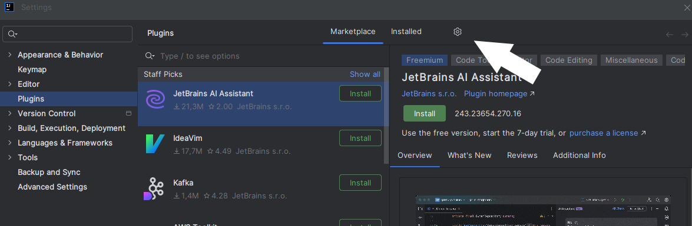
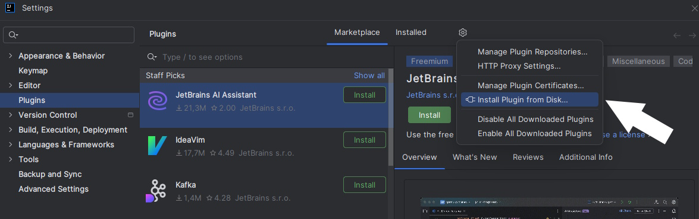

# IntelliGame
IntelliGame Plugin for IntelliJ to integrate Gamification with achievements and leaderboard into IntelliJ.

## Installation
### Requirements
- [IntelliJ IDEA 2024.3 or later](https://www.jetbrains.com/idea/download)
### How to
- Download the [last version of the plugin](https://github.com/ThibBer/IntelliGame/tags)
- Open IntelliJ -> File -> Settings -> Plugins
- Click on the gear icon 

- Click on "Install Plugin From Disk"

- Select plugin zip file
- Restart IDE

## Usage
If you don't have a trophy  on the left side of your IDE, you can open plugin window from ``View`` -> ``Tool windows`` -> ``Gamification``

Now, you must have the trophy on the left menu of your IDE

You can move it everywhere you want in the IDE.

## Development - How to add new Achievements

During development, the [IntelliJ Platform SDK](https://plugins.jetbrains.com/docs/intellij/welcome.html) serves as the primary source for documentation.

- Adding Achievements:
  - New Achievements should be stored in the [achievements](src/main/kotlin/de/uni_passau/fim/se2/intelligame/achievements) folder
  - The Achievements must implement the [Achievement interface](src/main/kotlin/de/uni_passau/fim/se2/intelligame/achievements/Achievement.kt).
  - Furthermore, Achievements usually implement a listener to react to specific user inputs. 
  These listeners, or in this case Achievements, are then subscribed to the [Message Bus](https://plugins.jetbrains.com/docs/intellij/messaging-infrastructure.html) with the help of the [plugin.xml](src/main/resources/META-INF/plugin.xml) or in the [ProjectService](src/main/kotlin/de/uni_passau/fim/se2/intelligame/services/ProjectService.kt) under the appropriate topic. 
  All possible listeners and the appropriate topics can be found [here](https://plugins.jetbrains.com/docs/intellij/extension-point-list.html#intellij-platform-listeners).
  Information on embedding the listeners can be found [here](https://plugins.jetbrains.com/docs/intellij/plugin-listeners.html).
  - In order to display the new Achievements in the Achievement Overview, they must be added to the appropriate Get method in the [Util](src/main/kotlin/de/uni_passau/fim/se2/intelligame/services/Util.kt) class. The Achievements are then automatically listed in the overview.
  - If a new Achievement group should be added, it has to be created in the [MoreInformationDialog](src/main/kotlin/de/uni_passau/fim/se2/intelligame/components/MoreInformationDialog.kt) synchronously to the existing groups and a new get method with the associated Achievements has to be defined in the [Util](src/main/kotlin/de/uni_passau/fim/se2/intelligame/services/Util.kt) class.
- To test the implementations, IntelliJ can be started using the intelliJ/runIde Gradle task in a sandbox that has the plugin installed.

---
Plugin based on the [IntelliJ Platform Plugin Template][template].

[template]: https://github.com/JetBrains/intellij-platform-plugin-template

<!-- Plugin description -->
A gamified plugin which rewards developers for positive testing behavior using a multi-level achievement system. It supports the following types of achievements for Java and JavaScript:

- Testing
- Coverage
- Debugging
- Test Refactoring
<!-- Plugin description end -->
